<div align="center">

```text
███████╗ ██████╗██╗   ██╗ █████╗ ███╗   ██╗
██╔════╝██╔════╝╚██╗ ██╔╝██╔══██╗████╗  ██║
█████╗  ██║      ╚████╔╝ ███████║██╔██╗ ██║
██╔══╝  ██║       ╚██╔╝  ██╔══██║██║╚██╗██║
██║     ╚██████╗   ██║   ██║  ██║██║ ╚████║
╚═╝      ╚═════╝   ╚═╝   ╚═╝  ╚═╝╚═╝  ╚═══╝
```

# `> whoami`

### `fcyan`

**Go Backend Developer · AI Agent Builder · 2027 Graduate**

`Building reliable backend systems and intelligent agents.`

[](https://github.com/fcy222fcy)
[](https://fcyan.xyz)


</div>

---

## `$ cat /etc/fcyan/profile`

```go
package main

type Developer struct {
    Name      string
    Role      string
    Focus     []string
    Stack     []string
    Status    string
}

var me = Developer{
    Name: "fcyan",
    Role: "Go Backend Developer",
    Focus: []string{
        "AI Agent",
        "RAG",
        "Distributed Systems",
        "Backend Engineering",
    },
    Stack: []string{
        "Go",
        "Gin",
        "PostgreSQL",
        "MySQL",
        "Redis",
        "Docker",
    },
    Status: "Building, learning, shipping.",
}
```

```text
[+] Go Backend Engineering
[+] AI Agent Architecture
[+] RAG & Knowledge Retrieval
[+] Redis / MQ / Cache
[+] Distributed Systems
[+] Backend Observability
[+] Always debugging...
```

---

## `$ ./skills --list`

<div align="center">

### `// BACKEND`


### `// ENGINEERING`


### `// AI ENGINEERING`


</div>

---

# `$ ls ~/projects/featured`

## 🍜 Shiyou

> **Campus food discovery & review platform**

[](https://fcyan.xyz)
[](https://github.com/fcy222fcy/shiyou)

```text
Shiyou
├── Authentication
│   ├── JWT Access / Refresh Token
│   ├── SMS / Email / Captcha
│   └── User Session
│
├── Business
│   ├── Shop Management
│   ├── Review System
│   ├── Ranking
│   └── GEO Location
│
├── Infrastructure
│   ├── Redis Cache
│   ├── Redis Stream
│   ├── WebSocket
│   ├── MinIO
│   └── Scheduled Jobs
│
└── Administration
    ├── RBAC
    ├── Operation Logs
    └── Audit Workflow
```

**Tech Stack**

`Go` · `Gin` · `GORM` · `MySQL` · `Redis` · `Redis Stream` · `WebSocket` · `MinIO` · `Docker` · `Nginx`

---

## 🤖 Qavor

> **AI Knowledge Base & Agent Development Platform**

```text
                     USER
                       │
                       ▼
                    AGENT
                       │
        ┌──────────────┼──────────────┐
        │              │              │
        ▼              ▼              ▼
     Skills           MCP           Tools
        │              │              │
        └──────────────┼──────────────┘
                       │
                       ▼
                      RAG
                       │
          ┌────────────┼────────────┐
          ▼            ▼            ▼
      Retrieval      Rerank     Knowledge Base
          │            │            │
          └────────────┼────────────┘
                       ▼
                      LLM
                       │
                       ▼
                    RESPONSE
```

### `> rag.pipeline`

```text
PDF / DOCX / Markdown / HTML
            │
            ▼
          Parse
            │
            ▼
         Markdown
            │
            ▼
          Chunk
            │
            ▼
        Embedding
            │
            ▼
       Vector Store
            │
            ▼
        Retrieval
            │
            ▼
         Rerank
            │
            ▼
          Agent
```

**Focus**

`Agent Orchestration` · `RAG` · `MCP` · `Skills` · `Tracing` · `Knowledge Base`

---

# `$ systemctl status fcyan`

```text
● fcyan.service - Backend Developer Runtime

     Loaded: loaded
     Active: active (running)
     Status: "Building backend systems & intelligent agents"

     Language: Go
     Runtime: Learning Mode
     Memory: coffee
     CPU: 100%

[ OK ] Go runtime initialized
[ OK ] Redis connected
[ OK ] Database connected
[ OK ] Agent runtime started
[ OK ] RAG pipeline ready
[ OK ] Debugger attached

> Waiting for the next challenge...
█
```

---

# `$ git log --oneline --author="fcyan"`

```text
a81c921 feat: build something useful
91b27ac feat: make agents smarter
63f021d perf: reduce unnecessary latency
20cc931 fix: another bug defeated
0xC0FFEE chore: refill coffee
```

---

# `$ github-stats --user fcy222fcy`

<div align="center">


</div>

---

# `$ languages --top`

<div align="center">



</div>

---

# `$ find ~/repositories -maxdepth 1 -type d`

```text
./shiyou
./causal-analysis-platform
./blog
./learning-notes
./knowledge-graph
./ai-blog
./chatroom
```

> Not every repository needs to be impressive.
> The important ones should prove how I think, design and build.

---

# `$ ./current_mission`

```yaml
developer: fcyan

main_language:
  - Go

direction:
  - Backend Engineering
  - AI Agent Engineering

currently_exploring:
  - Go Runtime
  - Distributed Systems
  - RAG
  - Agent Architecture
  - MCP
  - Observability
  - High Performance Backend

principles:
  - simple
  - reliable
  - observable
  - maintainable

mission:
  "Build systems that are simple, reliable and intelligent."

status:
  "Still compiling..."
```

---

<div align="center">

### `while (alive) { learn(); build(); debug(); ship(); }`

```text
┌───────────────────────────────────────────────┐
│                                               │
│     Go Backend  ×  AI Agent  ×  Engineering  │
│                                               │
│                    fcyan                      │
│                                               │
└───────────────────────────────────────────────┘
```

[](https://github.com/fcy222fcy)

`EOF`

</div>
